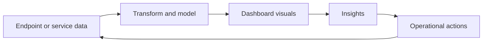

<!-- unified-readme:start -->
<div align="center">

# Power BI Dashboards

**Power BI dashboard templates for Microsoft Intune endpoint analytics and device management reporting.**

Measure. Visualize. Improve.

[](https://github.com/JayRHa/PowerBIDashboards/stargazers)
[](https://github.com/JayRHa/PowerBIDashboards/network/members)
[](https://github.com/JayRHa/PowerBIDashboards/issues)
[](https://github.com/JayRHa/PowerBIDashboards/graphs/contributors)

[Check out my blog](https://jannikreinhard.com)
<p>
  <a href="https://jannikreinhard.com/">Blog</a> ·
  <a href="https://www.linkedin.com/in/jannik-r/">LinkedIn</a> ·
  <a href="https://x.com/jannik_reinhard">X</a>
</p>

---

`Reporting` | `Dashboards` | `Public` | `Maintained`

</div>

## What is this?

Power BI Dashboards turns endpoint or operational data into dashboards and reporting views for analysis and decision making.

## Project Context

- Use it when raw endpoint data needs to become a readable report or dashboard.
- The flow depends on clean data shaping before visuals are useful.
- This repository is maintained as a practical project and reference asset.

## How It Works

Data is exported or connected, transformed into a report model, visualized in dashboards, then reviewed for trends, exceptions, and follow-up actions.



## Quick Start

1. Review the project context and workflow below.
2. Clone the repository:

   ```bash
   git clone https://github.com/JayRHa/PowerBIDashboards.git
   ```

3. Continue with the setup, usage, or workflow sections below.

---
<!-- unified-readme:end -->

## Intune Reporting Dashboard

